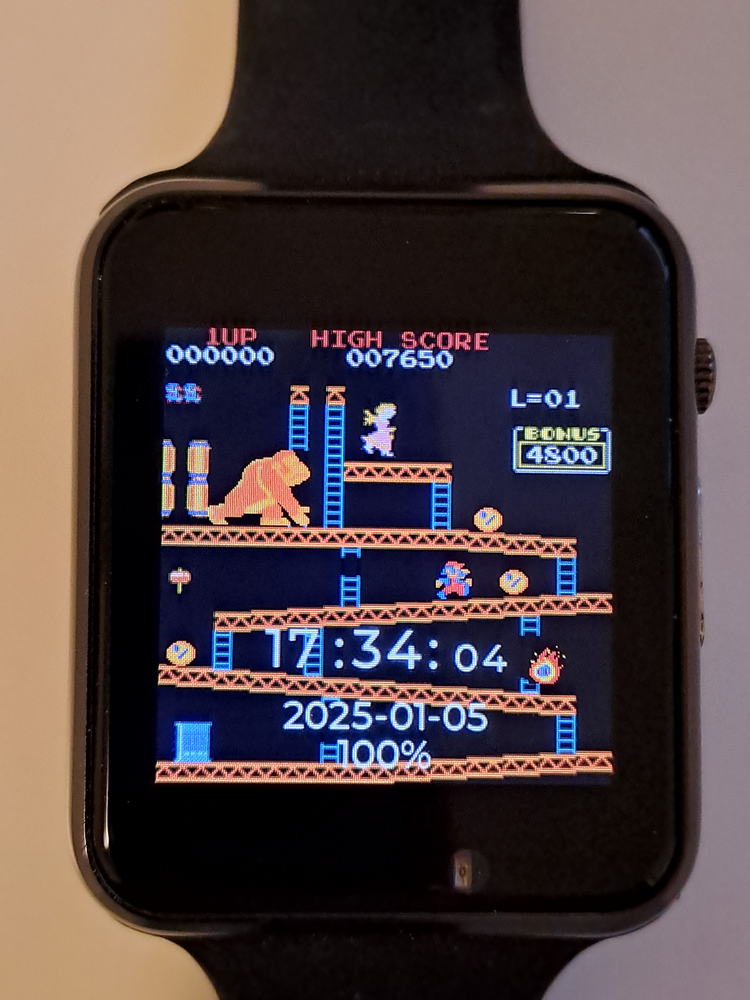
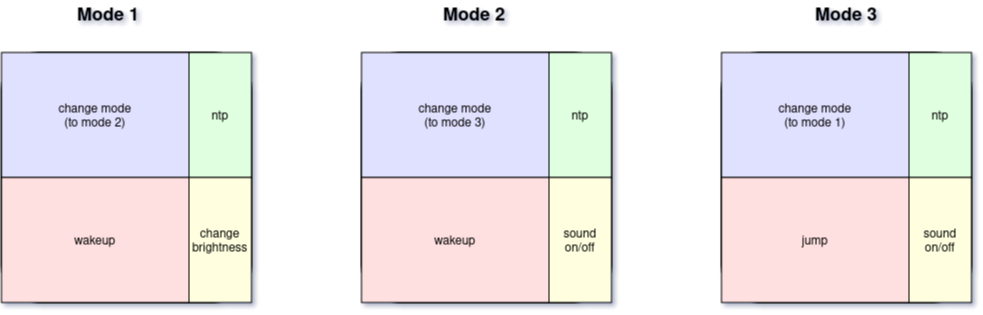

# Donkey Kong resp. Crazy Kong theme for LilyGo TWatch S3

## Installation

### Create docker image

As described under https://github.com/Xinyuan-LilyGO/TTGO_TWatch_Library/tree/t-watch-s3 you need to install specific libraries
and a specific (and quite old) Arduino core to set up the development environment. I choosed to create a docker image with all
the necessary libraries and the arduino-cli command as an entrypoint.

In order to make this setup work you may have to install podman first (if you use docker instead, you have to adapt the Makefile
accordingly).
You then can easily create the docker image "arduino-cli-twatch" using the following Makefile target:  
make install

### Compile code

As it is possible to synchronize the RTC via NTP, a WiFi connection must also be established if required.
The SSID and password are therefore required for the build process.
The credentials are transferred to the Makefile via environment variables (WIFI_SSID, WIFI_PASS).

Under Linux, the environment variables can be set in a script, for example:  
export WIFI_SSID="myssid”  
export WIFI_PASS="mypasswd”

The script must then be executed with the "source" command so that the environment variables are available in the current shell.

The code can then be compiled using the prepared docker image (which uses arduino-cli):  
make compile  
(or just make)

### Upload binary file

You may have to adapt the name of the serial port in the Makefile first (variable "PORT").
To upload the compiled program you can use the following Makefile target:  
make upload

## Usage

The watch is operated via the touchscreen.
The watch's touchscreen is divided into 4 areas. The left-hand area takes up 3/4 of the surface.
The division between the top and bottom is 50% each.
You can change the mode (1, 2, 3) via the top left area.

Mode 1 displays the time. It is possible to change the brightness in this mode (bottom right area).  
Mode 2 additionally shows the date, the current battery status and the switches for brightness and sound on/off.
It is possible to switch the sound on or off in this mode (bottom right area).  
In modes 1 and 2, the screen can be activated by touching the bottom left area.  
Mode 3 offers a mini-game. The game is initially in demo mode.
Touching the bottom left area activates the game and makes Mario jump.
The sound can also be activated or deactivated in this mode.  
In all modes, the time can be synchronized via NTP by double-touching the upper right area.

